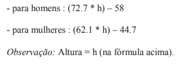

<h1>Estudo Hora De Codar 2: A Vingança do Coder</h1>
Exercício com intuito de expor os alunos do curso PROPROFISSÃO ao ambiente de resolução de problemas através de casos reais com o JavaScript. Com inferência de uso de condicionais, como if, else, switch case, etc. 

## Exercícios Propostos

  1) Escreva um programa em que o usuário informe dois números. Então escreva em tela o maior deles.
     
  2) Faça um programa que leia um valor informado pelo usuário e diga se o valor informado é positivo, negativo ou zero.
    
  3) Faça um programa para ler 3 valores (considere que não serão informados valores iguais) e escrever o maior deles. 
       
  4) Faça um programa que leia 3 valores informados pelo usuário (considere que não serão informados valores iguais) e escrever a soma dos 2 maiores.
    
  5) Faça um programa que leia 6 valores informados pelo usuário, calcule, exiba os números informados e escreva a média aritmética desses valores lidos.
    
  6) Faça um programa que receba quatro valores informados pelo usuário, mas informe somente o primeiro, o último e o maior de todos eles (considere que todos os números informados serão diferentes)
    
  7) Faça um programa que leia 6 números que o usuário vai informar. Todos os números lidos com valor inferior a 72 devem ser somados. Escreva o valor final da soma efetuada e também todos valores que o usuário informou.
    
  8) Escreva um programa que calcule a média de quatro números informados pelo usuário, mas somente se esses números forem maiores que 0 e menores que 10. No final, se a média for maior que cinco o usuário receberá uma mensagem "Você passou no teste". Em qualquer outra situação, ele receberá uma mensagem de "tente novamente"
    
  9) Escreva um programa para ler o ano de nascimento de uma pessoa e escrever uma mensagem que diga se ela poderá ou não votar este ano (não é necessário considerar o mês em que ela nasceu).
    
  10) Tendo como entrada a altura e o gênero designado ao nascer (codificado da seguinte forma: 1: feminino - 2: masculino - ) de uma pessoa, construa um programa que calcule e imprima seu peso ideal, utilizando as seguintes fórmulas.
Fórmula para cálculo
    

      
    

    
  11) Uma micro calculadora
Escreva um programa para ler 2 valores inteiros informados pelo usuário e uma das seguintes operações a serem executadas (codificada da seguinte forma: 1. Adição, 2. Subtração, 3. Divisão, 4. Multiplicação).
O programa deve calcular e escrever o resultado dessa operação sobre os dois valores lidos. 

<b>Observação:</b> Considere que só serão lidos os valores 1, 2, 3 ou 4 para as operações
     
